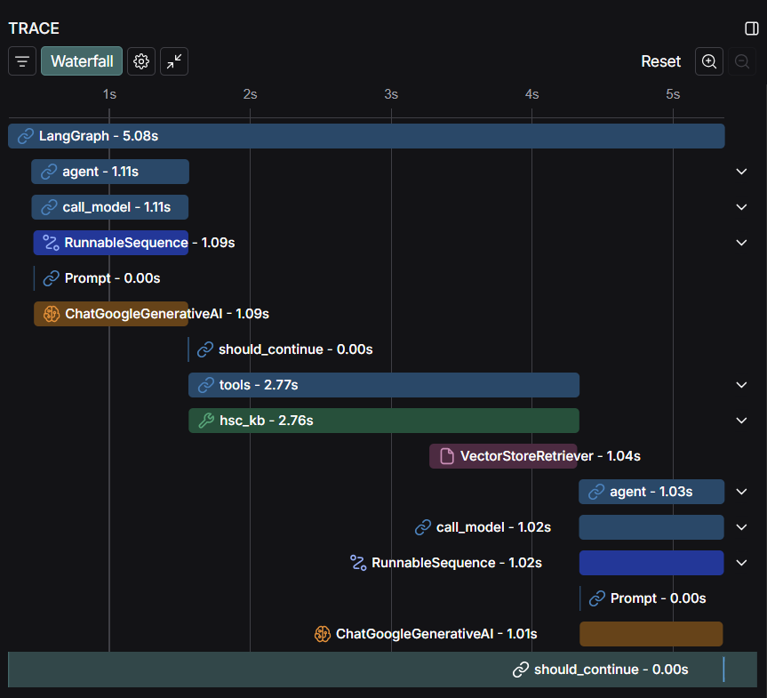

# HSC Bangla Bot

A conversational AI assistant for HSC Bangla First Paper, answering questions using a knowledge base extracted from the official textbook. It have `thread based memory support`, to keep the context of the current chat (short term memory) through out.

**Watch a quick demo of HSC Bangla Bot in action!**
[](https://www.youtube.com/watch?v=3Em5Sq18mjg)

## 🧮 Setup Guide

1. **Clone the repository** and install dependencies:
   ```bash
   pip install -r requirements.txt
   ```

2. **Set up environment variables** in a `.env` file:
   - `SUPABASE_PG_CONN_URL` (Postgres connection string)
   - `GOOGLE_API_KEY` (Google Gemini API key)
   - `OLLAMA_EMBEDDING_URL` (Ollama embedding server URL)
   - `LANGSMITH_API_KEY` (LangSmith API key, optional for tracing)

3. **Prepare the knowledge base** (if not already done):
   - Place the HSC Bangla 1st Paper PDF in `pdfs/HSC26-Bangla1st-Paper.pdf`.
   - Run:
     ```bash
     python KB_creation.py
     ```

4. **Start the API server**:
   ```bash
   python api.py
   ```

5. **(Optional) Run the Streamlit demo app**:
   ```bash
   streamlit run app.py
   ```


## 🛠️ Used Tools, Libraries, Packages

- **Large Language Model:** Gemini 2.5 Flash
- **Embedding Model:** BAAI-BGE-M3
- **LangChain** (core, community, google-genai, ollama, postgres)
- **LangGraph** (Agent building with memory)
- **Supabase** (Postgres vector store)
- **FastAPI** (API server)
- **Uvicorn** (ASGI server)
- **Streamlit** (demo UI)
- **Pytesseract** & **Pillow** (OCR for Bangla PDF)
- **httpx** (async HTTP client)
- **python-dotenv** (env management)
- **rich** (logging)
- **psycopg2-binary** (Postgres driver)

See `requirements.txt` for full list.


## Sample Queries & Outputs

**Bangla Example:**
- **Query:** `গল্পের মূল চরিত্র কারা?`
- **Output:** 
`"অপরিচিতা" গল্পের মূল চরিত্র হলো অনুপম। সে পিতৃহীন এবং তার মা ও মামার ওপর নির্ভরশীল। অনুপম শিক্ষিত হলেও তার নিজস্ব সিদ্ধান্ত নেওয়ার ক্ষমতা নেই এবং সে ব্যক্তিত্বহীন। গল্পের অন্যান্য গুরুত্বপূর্ণ চরিত্রগুলো হলো অনুপমের মামা (যিনি যৌতুকলোভী), শম্ভুনাথ সেন (কন্যার পিতা) এবং কল্যাণী (অনুপমের বাগদত্তা)।`

**English Example:**
- **Query:** `What was the age of Anupom?`
- **Output:** 
`বিবাহের সময় অনুপমের বয়স ছিল ২৭ বছর।`


> **Note:** The bot always responds in Bangla, as per its `design and prompt`.


## 🚀 API Documentation

### POST `/chat`

- **Description:** Get an answer to a Bangla First Paper question.
- **Request Body:**
  - `messages`: (string) User's question (Bangla)
  - `thread_id`: (string, optional) Unique session/thread ID

  ```json
  {
    "messages": "হরিশ কোথায় থাকে?",
    "thread_id": "e6bd0899-9db3-4fc5-8613-98a0bd0f1ce9"
  }
  ```


- **Example Request:**
  ```bash
  curl -X POST http://localhost:8000/chat \
    -H "Content-Type: application/json" \
    -d '{"messages": "হরিশ কোথায় থাকে?",
    "thread_id": "e6bd0899-9db3-4fc5-8613-98a0bd0f1ce9"}'
  ```

- **Example Response:**
  ```json
  {
    "response": "হরিশ কানপুরে কাজ করে।"
  }
  ```

## Evaluation (Work in Progress)
This is a typical run traced in langsmith (`input to output`).
[Live Link](https://smith.langchain.com/public/9bded364-fbbf-47f3-8f13-87aa0095162d/r)


---

**Note:**  
- The bot is designed for Bangla queries and answers only.
- The knowledge base is built from the official HSC Bangla 1st Paper PDF using OCR.

## ❓ Q/A: Technical Design & Choices

**Q: What method or library did you use to extract the text, and why? Did you face any formatting challenges with the PDF content?**

A: I used `pytesseract` (OCR) with `Pillow` to extract Bangla text from the PDF. Standard PDF text extraction libraries (like PyMuPDF or pdfplumber) were tried but those failed to extract Bangla text accurately due to font encoding issues. OCR was chosen as it reliably extracts Bangla script from scanned textbook pages, though it introduced some minor formatting artifacts.


**Q: What chunking strategy did you choose (e.g. paragraph-based, sentence-based, character limit)? Why do you think it works well for semantic retrieval?**

A: I chose a **character-based chunking** strategy using `RecursiveCharacterTextSplitter` with a chunk size of `800` and an overlap of `400`. This method ensures each chunk retains meaningful context while being small enough for efficient processing. The overlap preserves semantic continuity across chunks, which is especially beneficial for downstream retrieval and generation tasks.


**Q: What embedding model did you use? Why did you choose it? How does it capture the meaning of the text?**

A: The embedding model used is `BAAI-BGE-M3` via Ollama. This multilingual embedding model is state-of-the-art for semantic search and supports Bangla, making it suitable for capturing nuanced meanings in both queries and document chunks. It maps semantically similar texts to nearby points in vector space, enabling effective retrieval.


**Q: How are you comparing the query with your stored chunks? Why did you choose this similarity method and storage setup?**

A: Queries are embedded using the same model and compared to stored chunk embeddings using vector similarity (cosine similarity) in Supabase PGVector. This setup is scalable, efficient, and integrates well with LangChain for semantic retrieval tasks. 


**Q: How do you ensure that the question and the document chunks are compared meaningfully? What would happen if the query is vague or missing context?**

A: Both queries and document chunks are embedded in the same vector space, ensuring meaningful comparison. If a query is vague or lacks context, the retriever may return less relevant or generic chunks. Providing more specific queries generally yields better, more focused answers.

**Q: Do the results seem relevant? If not, what might improve them (e.g. better chunking, better embedding model, larger document)?**

A: The results are generally relevant for well-formed queries. Relevance can be further improved by:
- Using more advanced or domain-specific embedding models
- Tuning chunk size/overlap for the specific document
- Improving OCR quality or post-processing
- Expanding the knowledge base with more documents (If direct text files can be given input, that would be better than OCR processing)
